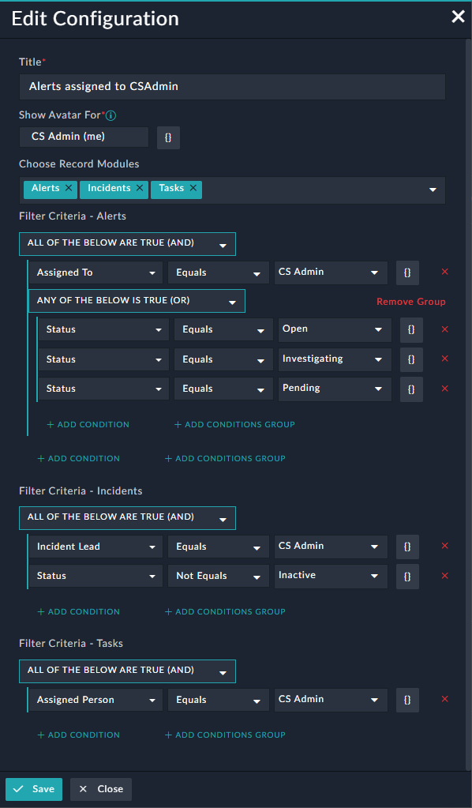

## User Tile

Displays the count of assigned records against the particular user. The user can select multiple modules and apply filters to build context around themselves.

**Certified**: Yes

**Publisher**: Fortinet

**Compatibility**: 7.0.2 or higher

**Applicable**: Dashboard, Reports, View Panel, Listing, Add Form

**Alerts Assigned to the User**:

 

**Edit Configuration**:

The user can select multiple modules and create filter conditions in order to display the record count for the respective module.

 
